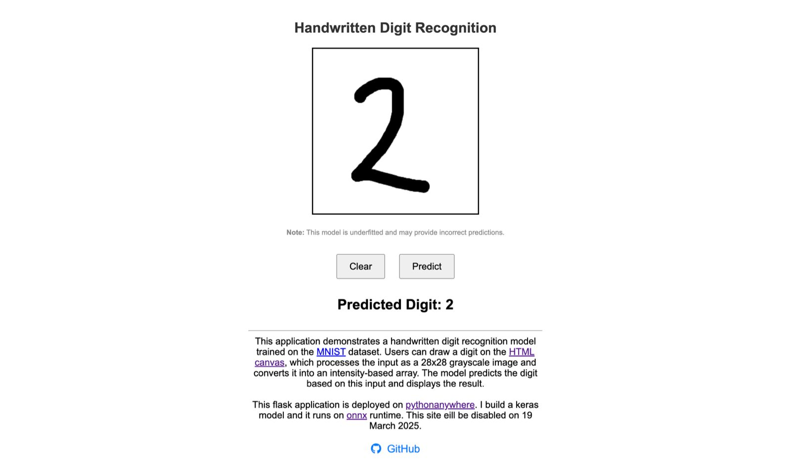

# Handwritten Digit Recognition

This project is a Flask-based web application that demonstrates a handwritten digit recognition model trained on the [MNIST dataset](https://www.kaggle.com/datasets/hotk/mnist-dataset). The application allows users to draw digits on an [HTML canvas](https://developer.mozilla.org/en-US/docs/Web/API/Canvas_API). The input is processed as a 28x28 grayscale image, converted into an intensity-based array, and passed to the model for prediction. The recognized digit is displayed in real-time.

## Features

- [x] **Interactive Drawing Canvas**: Users can draw on the web page.
- [x] **MNIST-trained Model**: The model is trained on the MNIST dataset, a standard dataset for handwritten digit recognition.
- [x] **Single Digit numbers**: Can predict single digit numbers.
- [ ] **All numbers**: Enable the model to recognize and interpret multi-digit numbers (e.g., 123)..
- [ ] **Calculate arithmetic operations**: Users can draw for example 2+2 and the model will output 4.

## How It Works

1. **Draw a Digit**: Use your mouse or touch input to draw a digit on the canvas.
2. **Process Input**: The canvas input is resized to 28x28 pixels and converted into a grayscale intensity-based array.
3. **Predict the Digit**: The processed data is sent to the Flask backend, where it is passed to an ONNX model for prediction.
4. **Display the Result**: The predicted digit is displayed on the web page.

## Deployment

This application is deployed on [PythonAnywhere](https://www.pythonanywhere.com/). Note that the hosted site will be **disabled on 19 March 2025**.

## Screenshots


_Example of the drawing canvas and predicted result._

## Limitations (as of current version)

- The model may occasionally misclassify digits, especially for poorly drawn inputs.
- It is trained on the MNIST dataset, which might not cover all real-world variations in handwriting styles.
- IT can recognise only single digit numbers.

## Run locally?

1. `git clone https://github.com/adimail/digit-recognizer.git`
1. `python3 -m venv venv`
1. `pip install -r requirements.txt`
1. `python app.py`

## Training Your Own Model

To train your own digit recognition model:

1. **Dataset**: Use the [MNIST dataset](https://www.kaggle.com/datasets/hotk/mnist-dataset), which contains grayscale images of handwritten digits (0-9) with dimensions 28x28 pixels.

2. **Model Training**: Train you model

3. **Export to ONNX**:

   - Convert the trained model to ONNX format using tools like `tf2onnx` for TensorFlow models or `torch.onnx` for PyTorch models.
   - Validate the exported ONNX model to confirm it produces the same predictions as your original model.

4. **Save your model**: save the model in the root project directory with name `mnist_model.onnx`

### Precautions

- **Input Shape**: Ensure the model accepts an input tensor of shape `(1, 28, 28)` for single grayscale images.
- **Normalization**: Input data must be normalized to the range `[0, 1]` for consistent predictions.
- **Error Handling**: Validate the model to handle edge cases, such as incomplete or poorly drawn digits, gracefully.

### Using Your Model

1. Replace the existing `mnist_model.onnx` file with your trained ONNX model in the project directory.

2. Update the `onnx_model_path` in `app.py`:

   ```python
   onnx_model_path = "./your_model_name.onnx"
   ```

### Model Inputs and Outputs

- **Inputs**:

  - The model expects a 28x28 grayscale image reshaped into a single-channel tensor: `(1, 28, 28)`.
  - Pixel intensity values should be normalized to the range `[0, 1]`.

- **Outputs**:
  - The model produces a probability distribution over 10 classes (digits 0-9).
  - Example output: `[0.1, 0.2, 0.05, 0.05, 0.3, 0.1, 0.05, 0.1, 0.02, 0.03]`, where the index with the highest probability is the predicted digit (in this case, `4`).
